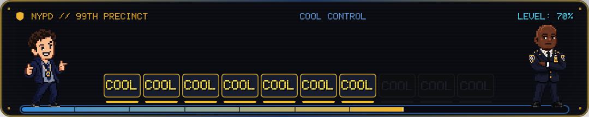

# CustomVolumeHUD (macOS) - Brooklyn Nine-Nine Edition 🚨

A custom pixel-art macOS Volume Heads-Up Display (HUD) themed around **Brooklyn Nine-Nine**, built natively with **Swift**, **AppKit**, and **SwiftUI**.



---

## The Concept

- Every new HUD session locks one of two complete pixel scenes until the pill has fully faded away. A shuffled two-scene bag guarantees one Holt and one Terry scene per pair, with randomized order.
- **COOL Control** keeps Jake Peralta on the left, excitedly rapid-firing:
  ```
  COOL COOL COOL COOL COOL COOL COOL COOL COOL COOL
  ```
  where each active `COOL` represents 10% volume.
- **Captain Raymond Holt** stands motionless and unimpressed as Jake gets progressively more excited.
- **Jake in Pursuit** turns volume into physical distance: Jake runs toward Terry as volume rises, retreats as it falls, and lands in Terry's arms at 100%.
- Jake returns to his standing sprite whenever he reaches the requested volume, while his feet remain anchored to the same lane used by the running frames.
- A segmented blue-to-gold volume pill gives both scenes a precise conventional readout without replacing the character animation.
- **Dynamic Directional Flow**: Increasing volume reveals words sequentially from Jake toward Holt with micro-delays and pixel bounces. Decreasing volume rapidly dissolves words right-to-left.
- **Special States & Reactions**:
  - **Mute**: All COOLs vanish immediately. After 300 ms, Holt displays a subtle *"Silence."* or *"Finally."* reaction.
  - **100% Volume**: Jake celebrates and Holt occasionally reacts with a raised eyebrow or *"Peralta."* speech bubble. Rare Easter eggs (*"NO DOUBT!"*, *"BINGPOT!"*) can trigger.
  - **Boundary presses**: pressing up again at 100% or down again at 0% still pops the pill and triggers mode-specific character feedback.
  - **Extended visibility**: the original 850 ms idle hold is extended by exactly two seconds; the 220 ms fade remains unchanged.

---

## Features

- 🎛️ **Native HUD Suppression**: Uses `CGEvent.tapCreate` to intercept volume keys (`F11`, `F12`, `Mute`) and suppress Apple's default bezel.
- 🔊 **CoreAudio Hardware Sync**: Authoritative system output volume synchronization with live device change listeners.
- 👾 **100% Nearest-Neighbor Pixel Art**: Custom `PixelArtSpriteView` ensures sprites remain sharp with zero bilinear blur on Retina displays.
- 📟 **Custom 5×7 Bitmap Font**: Built-in retro police computer typography engine (`PixelFont.swift`).
- ⚡ **Zero-Latency Catch-up**: Rapid keypresses collapse the animation queue (< 140 ms) so the HUD never lags behind actual volume changes.
- 🏃 **Continuous Terry-Mode Physics**: Jake's position converges without overshoot at up to 120 updates per second, while sprite frames intentionally retain arcade-style stepping.
- 📶 **Shared Pixel Volume Pill**: A retargetable 10-segment pill fills smoothly with the actual system volume and switches to a red empty state when muted.
- 🎬 **Session-Locked Balanced Scenes**: Scene selection happens once when the HUD appears and cannot change during input, hold, fade, or fade interruption. Each randomized pair contains one Holt and one Terry scene.
- 🪟 **Floating & Non-Activating**: Runs as an `NSPanel` at `.statusBar` level across all spaces (including full-screen apps and games) with click-through enabled.
- 🧼 **Invisible Background Agent**: Operates without a Dock icon or menu bar item; only the volume HUD appears.

---

## Quick Start

### 1. Run in Development Mode
Build and run directly using Swift Package Manager:

```bash
swift run
```

### 2. Build as a Standalone macOS App (`.app`)
Compile in Release mode and package into a signed `.app` bundle:

```bash
./scripts/build_app.sh
open CustomVolumeHUD.app
```

---

## Permissions (Accessibility)

To suppress the default macOS volume bezel:
1. Launch the application.
2. When prompted, open **System Settings > Privacy & Security > Accessibility**.
3. Enable the toggle for **CustomVolumeHUD** (or your terminal emulator if running via `swift run`).

---

## Testing

Run the automated test suite (46 unit, session, physics, and snapshot tests):

```bash
swift test
```

---

## Project Structure

```
CustomVolumeHUD/
├── Package.swift
├── scripts/
│   └── build_app.sh                  # Release bundler and code-signer
├── Sources/
│   ├── CustomVolumeHUD/              # Executable target entry point
│   │   └── main.swift
│   └── CustomVolumeHUDLib/           # Core library
│       ├── HUDWindowController.swift # Floating NSPanel controller
│       ├── MediaKeyInterceptor.swift # CGEventTap volume key interceptor
│       ├── PixelArtImageView.swift   # Nearest-neighbor pixel sprite renderer
│       ├── PixelFont.swift           # 5x7 bitmap retro font engine
│       ├── VolumeHUDView.swift       # Stable terminal HUD shell
│       ├── VolumeHUDViewModel.swift  # Interruptible animation state coordinator
│       ├── CoolHoltSceneView.swift   # COOL/Holt scene renderer
│       ├── RunToTerryScene.swift     # Continuous run/catch physics
│       ├── RunToTerrySceneView.swift # Terry scene renderer and sprite anchors
│       ├── VolumeManager.swift       # CoreAudio volume driver & listener
│       └── Resources/                # Transparent pixel art sprites
└── Tests/
    └── CustomVolumeHUDTests/         # 46 automated unit, session, physics, and snapshot tests
```
